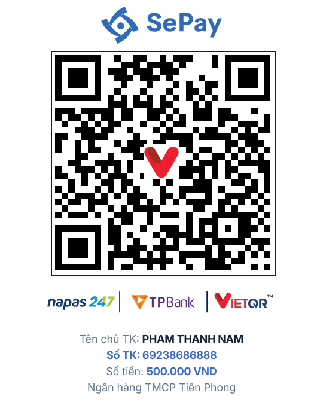

# Authorized Artifact Auditor

Bộ công cụ và tập hợp skill hỗ trợ phân tích phần mềm, khôi phục cấu trúc nguồn ở mức cần thiết, rà soát bảo mật, kiểm tra phụ thuộc và xây dựng kế hoạch khắc phục cho các hệ thống mà bạn sở hữu hoặc được phép đánh giá.

Dự án cung cấp cả hướng dẫn cho AI agent lẫn các CLI Python có thể chạy độc lập. Mọi workflow đều ưu tiên thu thập bằng chứng, báo cáo có thể kiểm chứng và biện pháp phòng thủ.

> [!IMPORTANT]
> Chỉ sử dụng dự án trên artifact, máy chủ, ứng dụng và hạ tầng thuộc quyền sở hữu của bạn hoặc nằm trong phạm vi được ủy quyền rõ ràng. Việc phân tích không mặc nhiên cho phép vượt xác thực, bản quyền, giấy phép, thanh toán hoặc các biện pháp kiểm soát truy cập. Xem [MASTER_POLICY.md](./MASTER_POLICY.md).

## Khả năng chính

| Nhóm | Khả năng |
|---|---|
| Điều phối | Nhận diện target và chọn workflow phù hợp; có thể tổng hợp nhiều phase vào một báo cáo |
| Artifact | Fingerprint binary, compiler, packager và framework; khôi phục cấu trúc phục vụ audit được ủy quyền |
| Web và mạng | Kiểm tra bề mặt dịch vụ, cấu hình TLS/header/CORS và các lỗi web trong phạm vi hợp pháp |
| Phụ thuộc và hạ tầng | Lập SBOM, rà soát supply chain, Docker, Kubernetes, Terraform và cấu hình cloud |
| Windows | Threat hunting trên Windows Event Logs và phân tích bằng chứng cục bộ |
| CVE và PoC công khai | Tra cứu CVE, EDB-ID, sản phẩm và phiên bản trong Exploit-DB mà không tự tải hoặc chạy exploit |
| Báo cáo | Sinh kết quả có cấu trúc, xếp mức độ nghiêm trọng và đề xuất remediation phòng thủ |

Các skill chuyên biệt nằm trong từng thư mục con. Điểm vào chính là [SKILL.md](./SKILL.md); danh sách công cụ ngoài và điều kiện cài đặt nằm trong [TOOLS.md](./TOOLS.md).

## Bắt đầu nhanh

Yêu cầu Python 3.10 trở lên. Một số workflow cần công cụ ngoài như Node.js, Android SDK, JADX, Nmap hoặc `ilspycmd`; chỉ cài chúng khi skill tương ứng yêu cầu.

```powershell
git clone https://github.com/ptn1411/skill.git
cd skill
python -m pip install -r requirements.txt
```

Phân tích một artifact được ủy quyền:

```powershell
python scripts\orchestrate.py "C:\path\to\owned-app.exe" --out output
```

Đánh giá một host hoặc URL và nhận báo cáo tổng hợp:

```powershell
python scripts\assess.py example.com --dry-run
python scripts\full_assess.py https://app.example.com --out output\assessment
```

Tra cứu một CVE trong Exploit-DB:

```powershell
python searching-exploit-db\scripts\search_exploit_db.py --cve CVE-2021-44228
```

Xem [INSTALL.md](./INSTALL.md) để biết thêm lệnh theo từng skill và cách tích hợp với CLI agent.

## Cấu trúc dự án

```text
skill/
├── SKILL.md                 # Điều phối và phạm vi chung
├── MASTER_POLICY.md         # Ranh giới ủy quyền và an toàn
├── INSTALL.md               # Hướng dẫn cài đặt chi tiết
├── TOOLS.md                 # Công cụ ngoài theo workflow
├── scripts/                 # Dispatcher và orchestrator
├── tests/                   # Kiểm thử hồi quy toàn dự án
├── <skill-name>/            # Skill chuyên biệt
│   ├── SKILL.md
│   ├── scripts/
│   └── references/
└── output/                  # Báo cáo và artifact do công cụ tạo
```

## Kiểm thử

Chạy toàn bộ unit test trước khi gửi thay đổi:

```powershell
python -m unittest discover -s tests -v
```

Khi thêm hoặc sửa một skill, kiểm tra contract của skill đó:

```powershell
python orchestrator-plugin-sdk\scripts\validate_skill_contract.py <skill-name>
```

Không commit dữ liệu nhạy cảm, token, thông tin xác thực, memory dump, traffic capture hoặc output thu từ hệ thống thật. Báo cáo công khai phải che giá trị bí mật và chỉ giữ vị trí hoặc fingerprint cần thiết.

## Đóng góp

Issue, tài liệu, test, workflow phòng thủ và cải tiến khả năng tương thích đều được chào đón.

1. Fork repository và tạo branch cho thay đổi của bạn.
2. Giữ mỗi pull request tập trung vào một vấn đề hoặc một skill.
3. Với skill mới, thêm `SKILL.md`, test có ý nghĩa và đăng ký skill trong dispatcher hoặc tài liệu liên quan.
4. Chạy toàn bộ test và kiểm tra không có secret hoặc output nhạy cảm trong diff.
5. Mở pull request, mô tả mục tiêu, phạm vi ủy quyền giả định và bằng chứng kiểm thử.

Bạn có thể [mở issue](https://github.com/ptn1411/skill/issues) để báo lỗi, đề xuất tính năng hoặc thảo luận trước một thay đổi lớn.

## Ủng hộ dự án

Nếu dự án giúp ích cho công việc nghiên cứu hoặc phòng thủ của bạn, bạn có thể ủng hộ để duy trì tài liệu, test và các workflow mới. Mọi khoản đóng góp đều hoàn toàn tự nguyện.

- Ngân hàng: **TPBank**
- Chủ tài khoản: **PHAM THANH NAM**
- Số tài khoản: **69238686888**

<p align="center">
  
</p>

Cảm ơn bạn đã sử dụng, phản hồi và đóng góp cho dự án.
